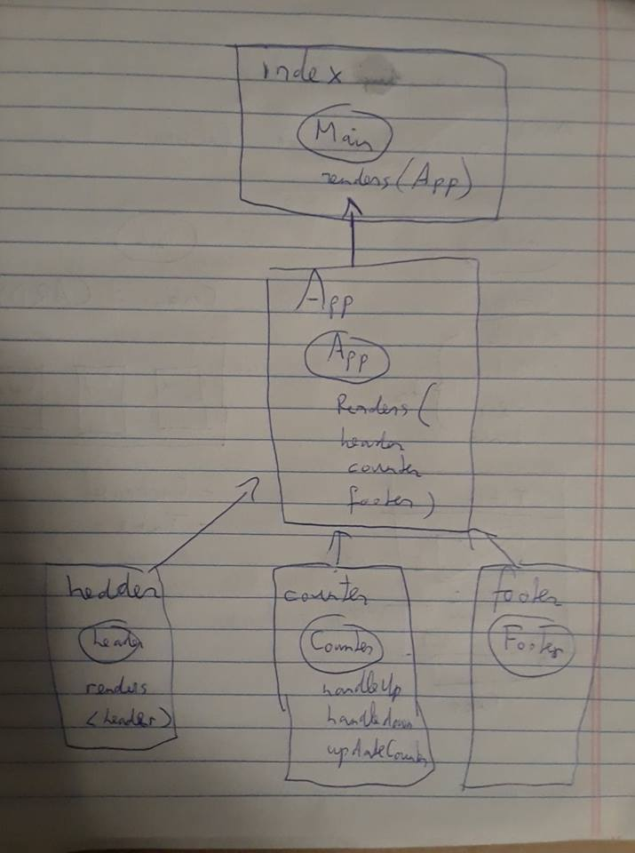

 LAB
=================================================

## Project Name

### Author: Student/Group Name

### Links and Resources
* [sandbox](https://codesandbox.io/s/github/trevorstam/lab-27-react-testing/tree/master/)
* [aws](issues deploying)

### Modules
#### `index.js`
##### Exported Values and Methods
`class Main`
`render(App)`

#### `App.js`
##### Exported Values and Methods
`class App`
`render(Header, Counter, Footer)`

#### `header.js`
##### Exported Values and Methods
`class Header`
`render(<header>)`

#### `counter.js`
##### Exported Values and Methods
`class Counter`
handleUp
handleDown
updateCounter
`render()`

#### `footer.js`
##### Exported Values and Methods
`class Footer`

#### Tests
Check sandbox for jest & enzyme tests

#### UML

